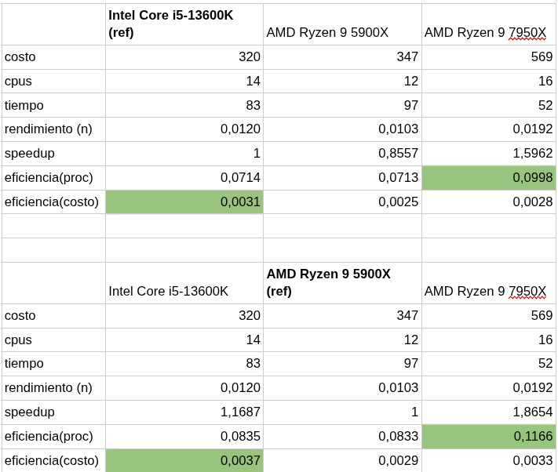
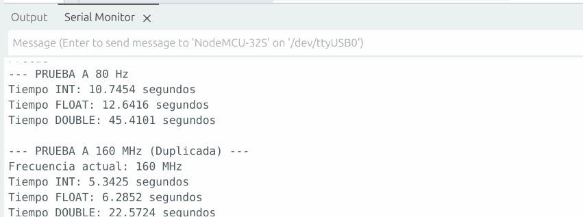

# Sistemas de Computación
# Trabajo Práctico 1 - Rendimiento

**Integrantes:**
- Aguilar Bazán, Lautaro Ismael
- Faro, Tomás Martin
- Monaldi, Renata

---

## 📝 Resumen del Trabajo
Aquí puedes pegar una síntesis breve del texto de tu informe, introducción, metodología y conclusiones.

## 1. Lista de Benchmarks

| Tarea | Benchmark |
| :--- | :--- |
| Uso general y productividad diaria | Geekbench 6 |
| Edición de vídeo y renderizado | Cinebench |
| Gaming y rendimiento gráfico | 3DMark |
| Almacenamiento (SSD / HDD) | CrystalDiskMark |
| Velocidad y capacidad de respuesta de los navegadores web | Speedometer 3.0 |

Elegimos el Benchmark Speedometer 3.0 para correr cada uno en nuestras computadoras, 

Speedometer 3.0 simula lo que hace un usuario real navegando por internet.
Evalúa la fluidez con la que el navegador procesa acciones complejas mediante:
Aplicaciones Web Modernas (Frameworks): Ejecuta tareas en simulaciones de apps creadas con React, Angular, Vue, Svelte, etc.
Edición de Texto Rico: Mide la respuesta al cargar y editar documentos en editores web de código o texto.
Renderizado de Gráficos: Evalúa el rendimiento cargando gráficos interactivos en Canvas y SVG.S
Navegación por Portales de Noticias: Simula la interacción en páginas web pesadas creadas con tecnologías de renderizado moderno como Next.js y Nuxt.

Al finalizar la prueba, te devuelve una puntuación numérica: a mayor puntaje, más fluido y rápido responderá ese navegador en tu procesador y sistema operativo. 

Los test realizados en cada una de nuestras computadoras se encuentran subidos en la carpeta [Capturas](./Capturas).

## 2.

Aceleración (Speedup) del Ryzen 7950X:
Frente al i5, su speedup es 1.5962 (59.6% más rápido).
Frente al Ryzen 5900X, su speedup es 1.8654 (86.5% más rápido).
Eficiencia de procesador (núcleos): El Ryzen 7950X gana en ambas tablas (0.0998 y 0.1166), siendo el que mejor rinde por cada núcleo.

Eficiencia de costo (dinero): El i5-13600K gana en ambas tablas (0.00352 y 0.00411), siendo el que mejor speedup entrega por cada dólar invertido.

## 3.

Para este punto realizamos un código que realiza el calcula de la suma de N iteraciones, realizamos la misma operación para enteros, punto flotante y double, primero con una frecuencia de 80mhz y luego la actualizamos con setCpuFrequencyMhz a 160Mhz, como era de esperar el tiempo de ejecución del cálculo se redujo a la mitad al duplicar la frecuencia ya que, el tiempo de ejecución es inversamente proporcional a la frecuencia del core.

El código fuente utilizado para las pruebas de frecuencia de la CPU se encuentra disponible en [`./resources/PruebaFrecuencia.ino`](./resources/PruebaFrecuencia.ino).

## 4.

Para este punto realizamos el tutorial descripto en time profiling siguiendo las instrucciones de https://www.thegeekstuff.com/2012/08/gprof-tutorial/ .

Luego asentamos los resultados en la hoja de cálculos de Resultados obteniendo llamativas diferencias entre los distintos integrantes del grupo en sus computadoras.
Las capturas de pantalla de cada uno de los resultados ([Lautaro](./Capturas/Aguilar%20Bazán/), Renata, Tomas)
Según la ia se pueden aplicar flags de optimización en gcc, agregando -02 o -03, por ejemplo gcc -O3 -Wall -pg test_gprof.c test_gprof_new.c -o test_gprof. Identificando así los bucles que no producen ningún efecto útil  y los elimina o simplifica.
